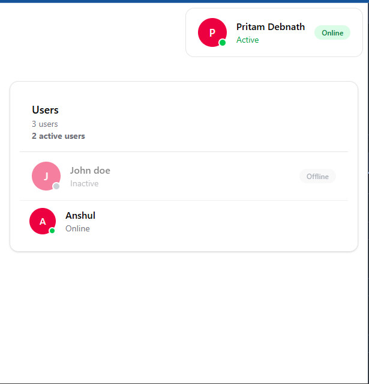
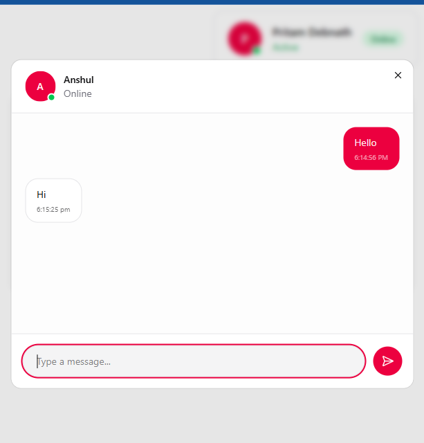

## 🔴 Demo

### 🔴 🖼️ Screenshot

<div style="display: flex; justify-content: space-around;">
  
    <span style="font-size: 40px; font-weight: bold;">→</span>
  
</div>

### 🔴 🎥 Video


⬇️ <a href="" download="">
  Download Demo Video
</a>


---

# Basic chat application.

basic chat application made with PostgreSQL, NodeJS

---

## Overview


---
# Set Up 
## Frontend Set Up
```
cd vedaz-assessment
``` 
```
pnpm install
``` 
```
npm run corepack:enable
``` 
```
cd frontend
``` 
```
npm run dev
``` 
```
http://localhost:5173/
```

## Backend Set Up
```
cd vedaz-assessment
``` 
```
pnpm install
``` 
```
npm run corepack:enable
``` 
```
docker compose up
```
```
cd backend
``` 

```
npm run dev
```
---
